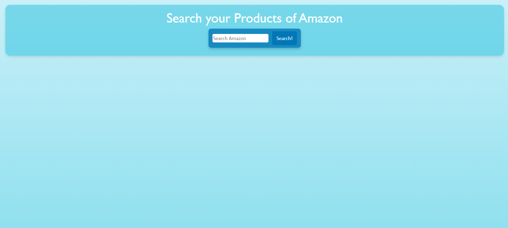
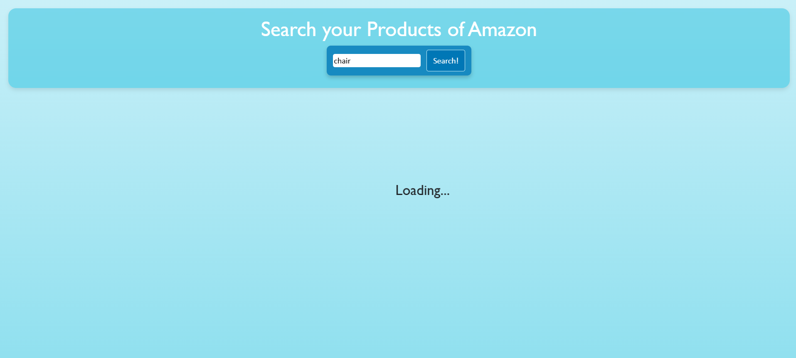
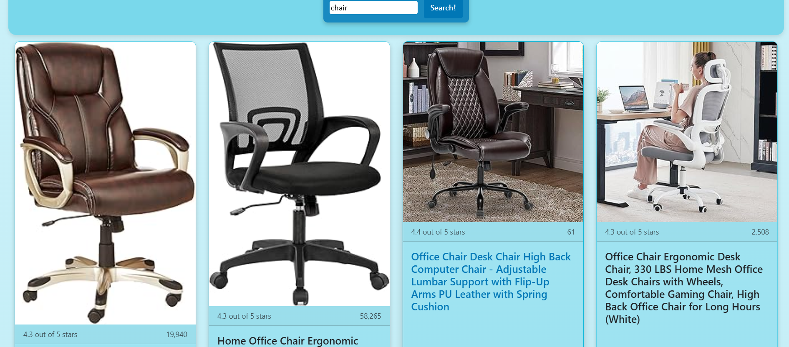

# Amazon Product Scraper | Fullstack Developer Test

## 📌 Project Overview

A fullstack application that scrapes and displays Amazon product data based on user search queries.

### Backend

- **Runtime**: Bun
- **Framework**: Express
- **Libraries**:
  - Axios (HTTP requests)
  - JSDOM (HTML parsing)
  - CORS (Cross-origin requests)

### Frontend

- **Build Tool**: Vite
- **Core**: Vanilla JavaScript
- **Styling**: CSS - Bootstrap

## 🚀 Installation & Setup

### Prerequisites

- [Bun](https://bun.sh/) v1.0+ or [Node.js](https://nodejs.org/) v18+

### Clone the Repository

```bash
git clone https://github.com/pnadales/AmazonTestProject.git
cd AmazonTestProject
```

### Backend Setup

1. Navigate to backend folder:

```bash
cd backend
```

2. Install dependencies:

```bash
bun install
```

3. Start development server:

```bash
bun run dev
```

_The API will run on `http://localhost:3000`_

### Frontend Setup

1. Navigate to frontend folder:

```bash
cd frontend #or cd ../frontend if you are in the backend folder

```

2. Build the project:

```bash
npm run build
```

3. Start the server:

```bash
npm run preview
```

_The frontend will run on `http://localhost:4173`_

### 🌐 API Endpoints

- `/api/scrape`:

  - **Method**: GET
  - **Query Params**:

    - `keyword`: The search term to scrape products from Amazon (**required**).

  - **Example**: `GET http://localhost:3000/api/scrape?keyword=laptop`

## Screenshots







---

**📢 Important Note**:  
This is an **educational project only**. Web scraping may violate Amazon's Terms of Service.
